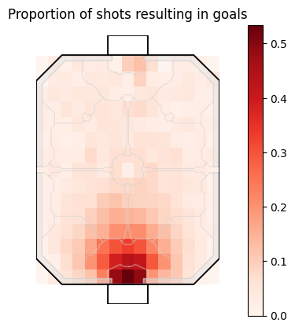
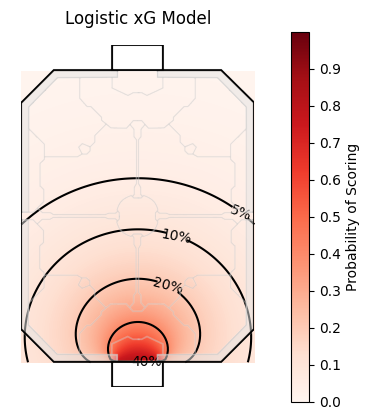
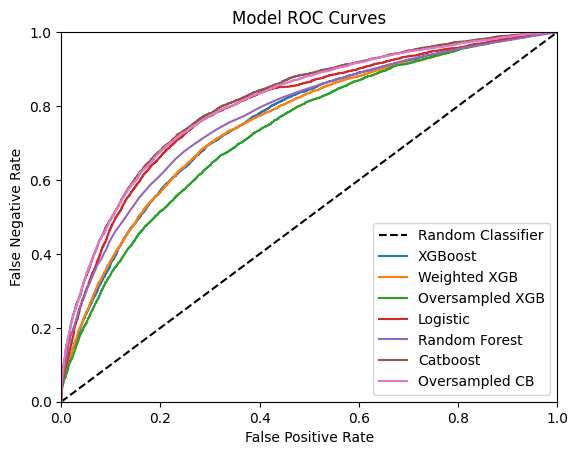
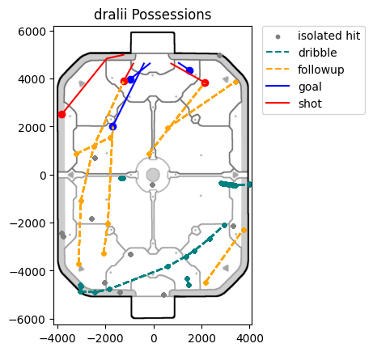

# RocketXG

Analysis framework for Rocket League. Driven by Expected Goal (xG) modeling. Plans for more advanced models.

---

## Model Results [WIP]
RLCS 2023-24 Data | xG Model
:----------------:|:-------:
|

---

## Possession Framework

Replays are treated as linked possession chains. Once one teams possession ends the other begins. These team possession chains are themselves a series of player possessions. This framework allows for complex analysis on pre-shot events as well as passes.

Features can be engineered on three different levels: possession chains, possessions and hits.

---

## Future Scope

- Post Shot Expected Goal (PSxG)
- Expected Threat (xT)
- Expected Assist (xA)
- Pitch Control Model

---

## Preliminary Figures
